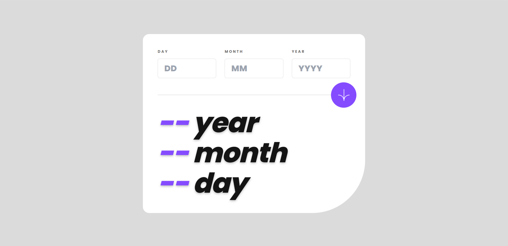

# FrontEnd Mentor | Age Calculator App


This is the solution to [Age Calculator App](https://www.frontendmentor.io/challenges/age-calculator-app-dF9DFFpj-Q/hub). A perfect challenge if you're trying to logic and web desing.

<h2 align="center">Links</h2>

-   Solution: [Frontend | Age Calculator App](https://www.frontendmentor.io/solutions/age-calculator-app-vmSzN2t9fP)
-   Solution Site: [Age Calculator App](https://frontend-mentor-bvuz.vercel.app/)

## Process

### Built with

-   [NextJS](https://nextjs.org/docs)
-   [Tailwind](https://tailwindcss.com/docs/installation)

## Author

-   Frontend Mentor - [@HenryLima07](https://www.frontendmentor.io/profile/HenryLima07)

## Acknowledgments

Using `next js` in order to build this solution

```bash
npx create-next-app@latest
```

-   Run in develop mode:

```bash
npm run dev
```

-   Run as build:

```bash
npm run build
npm run start
```

## File structure

```
.
├── design
│   └── preview-solution.png
├── hooks
│   └── date-calculator.hook.tsx
├── images
│   ├── favicon-32x32.png
│   └── image-qr-code.png
├── components
|   ├── Card
|   |   ├── Card.component.tsx
|   |   └── style.css
|   ├── Day
|   |   ├── Day.component.tsx
|   |   └── style.css
|   ├── InputDay
|   |   ├── InputDay.component.tsx
|   |   └── style.css
|   ├── assets
│   |   └── fonts
└── README.md
```
